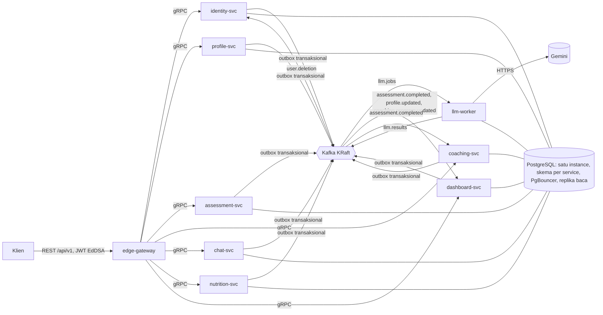

# Selaras Platform (Go)

[](https://github.com/muhananaufal/selaras-platform-go/actions/workflows/ci.yml)

Sembilan unit Go — satu gateway REST, tujuh service domain, satu worker LLM —
hasil migrasi dari monolit Laravel `selaras-backend-api` (32 endpoint, nol
test). Dibangun seolah produksi sejak baris pertama (ADR-016): setiap klaim
di halaman ini menunjuk ke berkas yang memuat buktinya, dan yang belum
terbukti ditulis sebagai yang belum terbukti.

> **For English readers.** A Laravel monolith decomposed into nine Go units
> (REST edge, seven gRPC domain services, one LLM worker) over PostgreSQL
> schema-per-service, Kafka with a transactional outbox, OpenTelemetry, Helm
> on k3d, chaos and restore drills. Every number below links to the file that
> measured it. Docs are in Indonesian; code, comments, identifiers, and logs are English.

## Bentuk sistem



| Lapisan | Pilihan | Alasan tertulis |
| :--- | :--- | :--- |
| Batas unit | 9 unit, `profile-svc` berdiri sendiri | [ADR-002](docs/adr/ADR-002-topologi-9-unit-profile-svc-berdiri-sendiri.md) |
| Konsistensi lintas unit | Outbox transaksional + referensi lunak, tanpa FK lintas skema | [ADR-004](docs/adr/ADR-004-konsistensi-transactional-outbox-referensi-lunak.md), [ADR-006](docs/adr/ADR-006-database-postgresql-schema-per-service-satu-inst.md) |
| Transport | gRPC di dalam, REST di tepi, id publik berupa slug | [ADR-005](docs/adr/ADR-005-transport-grpc-internal-rest-di-edge-id-publik-b.md) |
| Sesi | JWT EdDSA berumur pendek, pencabutan lewat penghitung generasi di Redis, gagal-tertutup | [ADR-020](docs/adr/ADR-020-token-eddsa-pencabutan-lewat-penghitung-generasi.md) |
| Kepemilikan | Service tidak mempercayai identitas yang sekadar dikirimkan; pemilik adalah pengguna | [ADR-023](docs/adr/ADR-023-service-tidak-mempercayai-identitas-yang-dikirimkan.md), [ADR-024](docs/adr/ADR-024-pemilik-adalah-pengguna-bukan-profilnya.md) |
| Penghapusan akun | Saga dengan kompensasi, 14 probe verifikasi | [ADR-011](docs/adr/ADR-011-penghapusan-akun-sebagai-saga-dengan-kompensasi.md) |
| Skala | HPA untuk HTTP, KEDA (lag Kafka) untuk worker | [ADR-014](docs/adr/ADR-014-autoscaling-hpa-untuk-http-keda-lag-based-untuk-.md) |
| Kuota LLM | Pekerjaan diparkir saat kuota habis, bukan dimatikan | [ADR-025](docs/adr/ADR-025-kuota-penyedia-llm-memarkir-pekerjaan-bukan-mematikannya.md) |
| Autentikasi antar-service | Setiap service memverifikasi token pengguna dengan kunci publik; `sub` harus sama dengan `user_id` | [ADR-026](docs/adr/ADR-026-setiap-service-memverifikasi-token-pengguna-sendiri.md) |

Dua puluh enam ADR, masing-masing dengan **pembatal** — kondisi yang membuat
keputusannya gugur: [`docs/adr/`](docs/adr/README.md). Mengapa sistemnya
dipecah, dan apa yang dijanjikan: [RFC-000](docs/rfc/RFC-000-platform-decomposition.md).
Apa yang benar-benar terjadi, termasuk yang gagal: [RFC-999](docs/rfc/RFC-999-retrospective.md).

## Yang sudah dibuktikan dengan menjalankannya

| Klaim | Angka | Bukti |
| :--- | :--- | :--- |
| Paritas mesin risiko SCORE2 / SCORE2-OP / SCORE2-Diabetes dengan sistem lama | 288 dari 288 golden vector, selisih terbesar nol | [`docs/parity-report.md`](docs/parity-report.md) |
| Latensi di bawah beban k6 | p95 baca 4,4 ms · tulis 14,5 ms · campuran 9,7 ms, nol gagal | [`docs/performance-report.md`](docs/performance-report.md) |
| Satu trace menembus gateway → service → worker | 6 span, 3 unit, utuh di Tempo | [`docs/observability.md`](docs/observability.md) |
| Broker dimatikan paksa di tengah beban | 18 event tertahan di outbox, 0 hilang, 8/8 pekerjaan selesai setelah broker kembali | [`test/chaos/broker.md`](test/chaos/broker.md) |
| Satu service mati | Gateway menjawab 504 dalam 5 detik, bukan menggantung; pulih 2 detik | [`test/chaos/service.md`](test/chaos/service.md) |
| Penyedia LLM lambat / kadang gagal / selalu gagal | Diulang, lalu menyerah dengan status yang jujur ke pengguna | [`test/chaos/llm.md`](test/chaos/llm.md) |
| Backup dipulihkan, bukan diasumsikan | 29 detik dari stop sampai gateway siap; 40 pengguna, 1.671 penilaian utuh; e2e hijau sesudahnya | [`docs/runbook/restore-drill.md`](docs/runbook/restore-drill.md) |
| Autoscaling di k3d | edge 1→4 replika, service 1→3 di bawah 60 VU; batas satu node dinyatakan | [`docs/performance-report.md`](docs/performance-report.md) |
| Koneksi Postgres saat replika bertambah | PgBouncer mode transaksi: ≤ 64 koneksi ke Postgres berapa pun replikanya; replika baca lag 10 ms | [`docs/db-connections.md`](docs/db-connections.md) |
| Token LLM sungguhan | Diukur dari `usageMetadata` Gemini: token "pikiran" model 3.x 3–4× token jawaban | [`docs/finops.md`](docs/finops.md) |
| Alert diturunkan dari SLO dan benar-benar menyala | Unit dimatikan → `page` di Prometheus dan surel di Mailpit dalam 2 menit 20 detik; 8 aturan, tiap aturan ber-unit-test (`promtool test rules`) di CI | [`docs/observability.md`](docs/observability.md) |
| Chart Helm dikeraskan | NetworkPolicy default-deny + izin dari grafik `*_GRPC_TARGET`, PDB, spread antar node, non-root/read-only/drop ALL; `helm lint --strict` + kubeconform di CI | [`deploy/helm/selaras/templates/`](deploy/helm/selaras/templates/) |
| gRPC internal tidak lagi mempercayai `user_id` | Langsung ke port gRPC profile-svc: tanpa token → `Unauthenticated`, token orang lain → `PermissionDenied`, pemilik sendiri lolos | [`test/e2e/security_test.go`](test/e2e/security_test.go) |
| Aturan domain D1–D12 dan celah keamanan S1–S11 dari sistem lama | Satu test penerimaan bernama per aturan | [`test/acceptance/`](test/acceptance/) |

Yang **belum** terbukti, sengaja tidak disembunyikan: baseline k6 sistem lama
tidak pernah diukur (SLO diturunkan dari angka Go sendiri, provisional);
ambang HPA belum diturunkan dari SLO; token terukur untuk 2 dari 6 templat.
Daftar lengkapnya di RFC-999 §3.

## Yang ditemukan karena dijalankan, bukan karena ditinjau

Tiga puluh temuan bernomor (B1–B30) di dokumen rencana; yang terpenting
lahir dari chaos, trace, dan larian nyata — bukan dari membaca kode:

- Konsumen yang berputar selamanya pada hasil milik entitas yang sudah
  dihapus — terlihat satu menit setelah Tempo menyala (B22).
- Gateway yang menggantung, bukan gagal, saat satu service mati — tidak ada
  tenggat pada panggilan lintas unit (F9-13).
- Scale-to-zero yang tidak bisa bangun — metrik lag diterbitkan oleh yang
  seharusnya dibangunkan (B24).
- Konsumen dan relay outbox yang terjebak id topic lama setelah broker
  kehilangan datanya — franz-go sengaja tidak pulih sendiri (B26, kini pulih
  tanpa restart; test integrasinya membuat ulang topic di broker sungguhan).
- Aturan domain "satu program per analisis" yang lima fase berstatus ✅
  tetapi tidak pernah ditegakkan — test penerimaannya yang menemukan (B27).
- Klien Gemini yang mengabaikan `retryDelay` dan worker yang mematikan
  pekerjaan dalam hitungan detik saat kuota gratis habis (B30).

## Menjalankan

Prasyarat: Go (versi di `go.mod`), Docker, [Task](https://taskfile.dev),
`golangci-lint`, `buf`, `vacuum`. Kredensial tidak punya nilai bawaan di mana
pun (ADR-016): salin `.env.example` ke `.env` dan isi.

```bash
task up:full          # postgres, pgbouncer, replika, kafka, redis, mailpit, 9 unit, observabilitas
task test:e2e         # suite ujung ke ujung terhadap stack yang menyala
task k6 -- read       # beban baca; write, mixed
task down:apps        # unit dimatikan, dependensi tetap
task test:integration # unit + integrasi; menolak berjalan bila unit masih hidup (B29)
task k3d:all          # klaster k3d: infra, migrasi, topic, chart Helm, KEDA
```

Perintah lain: `task --list`. Setiap unit punya runbook di
[`docs/runbook/`](docs/runbook/) — cara menyalakan, gejala, dan yang harus
dilakukan saat pukul tiga pagi.

## Cara kerja yang mengikat

| | |
| :--- | :--- |
| **Domain bebas library** | `internal/<unit>/domain` tidak mengimpor adapter apa pun; penyedia LLM palsu tidak bisa menyentuh jaringan karena paket induknya tidak punya paket jaringan |
| **Test yang disaksikan merah** | Bugfix membawa reproduksi yang merah lebih dulu; sekitar lima puluh mutasi sepanjang F6–F9 menyingkap test yang tidak menguji apa-apa |
| **Nol** | Nol `TODO`, nol kredensial hardcode, nol `interface{}` telanjang, nol galat yang ditelan; `golangci-lint` bersih |
| **Kontrak dulu** | `api/proto` adalah sumber kebenaran gRPC; `api/openapi/edge-v1.yaml` di-lint di CI; perubahan breaking terdeteksi `buf breaking` |
| **Skema per service** | Peran Postgres `svc_<unit>` hanya melihat skemanya; join lintas unit ditolak basis data, bukan oleh disiplin |

## Layout

```
cmd/<unit>/            entrypoint tiap unit; migrate, topics, partitions, deletion-verify
internal/<unit>/       domain · app · adapter (grpc, postgres, consumer)
internal/platform/     outbox, kafka, idempotency, telemetry, partition, rpc
api/proto · api/openapi   kontrak gRPC dan REST
migrations/<unit>/     migrasi per skema
deploy/compose · helm · k8s · k3d
test/acceptance · e2e · chaos · k6 · drill
docs/adr · rfc · runbook   dan laporan pengukuran
docs/reel/             showcase interaktif: alur dan mekanisme dianimasikan langkah demi langkah dari kode sumbernya
```

Rencana migrasi, evidence ledger, backlog 200-an task, dan katalog temuan
sistem lama ada di repo Laravel pada `docs/migration-plan/`.

## Lisensi

MIT — lihat [`LICENSE`](LICENSE). Celah keamanan dilaporkan lewat [`SECURITY.md`](SECURITY.md), bukan issue publik.
