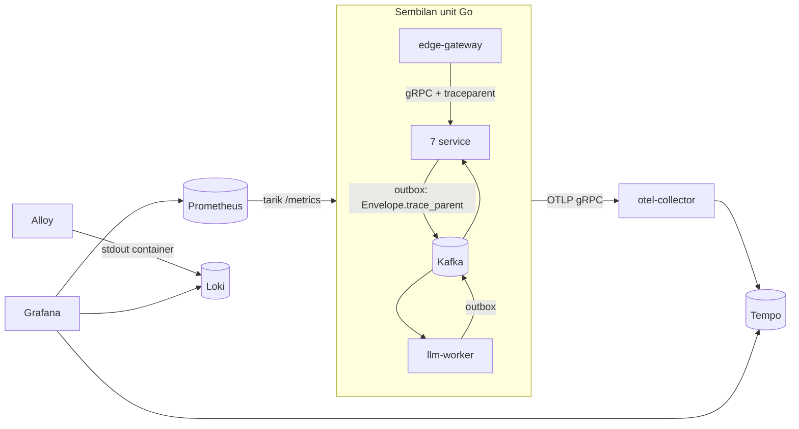

# Observability — trace, metrik, dan log yang saling terhubung

Dokumen ini adalah bukti F9-05 sampai F9-08, dan cara membaca ketiganya bila
ada yang salah. Seluruh angka di bawah diambil dari stack lokal pada
2026-09-07, bukan dari perkiraan.

## Yang dipasang



| Komponen | Versi | Peran | Batas memori |
| :--- | :--- | :--- | ---: |
| otel-collector | 0.159.0 | satu pintu masuk OTLP; unit tidak tahu Tempo ada | 256 MB |
| Tempo | 3.0.3 | penyimpanan trace, backend berkas lokal | 384 MB |
| Prometheus | 3.14.0 | menarik `/metrics` sembilan unit setiap 15 detik | 512 MB |
| Loki | 3.7.7 | penyimpanan log, retensi 7 hari | 384 MB |
| Alloy | 1.19.2 | membaca stdout container lewat socket Docker, kirim ke Loki | 192 MB |
| Grafana | 13.2.1 | tiga sumber data terhubung, dashboard dari berkas | 384 MB |

Konfigurasinya di `deploy/compose/observability/`; dinyalakan dengan
`task up:full`. Profil `up:apps` TIDAK menyalakannya dan unit berjalan dengan
tracer tanpa-operasi — dinyatakan di log saat start sebagai
`tracing is off; spans are not exported`.

## Bagaimana trace menyeberang

Tiga jembatan, dan yang ketiga yang tidak datang dari pustaka mana pun:

1. **HTTP → gRPC.** `otelgin` membuka span server di gateway; `otelgrpc` di
   klien gRPC menyisipkan `traceparent` ke metadata, dan `otelgrpc` di server
   membukanya sebagai span anak. Probe kesehatan dan reflection disaring.
2. **gRPC → gRPC.** Sama: identity-svc → profile-svc, assessment-svc →
   profile-svc.
3. **Service → broker → konsumen.** Event ditulis ke tabel outbox dan
   diterbitkan belakangan oleh relay yang tidak tahu apa-apa soal permintaan
   asalnya. Karena itu penulis outbox menyalin `traceparent` ke dalam
   `Envelope.trace_parent` (field 7), dan setiap konsumen membuka span-nya
   sebagai ANAK dari span penulis — bukan trace baru yang ditautkan. Yang
   ingin dijawab adalah "apa yang terjadi pada permintaan pengguna ini", dan
   jawabannya harus terbaca sebagai satu trace.

## Bukti F9-07: satu trace, tiga unit

Permintaan `PATCH /api/v1/risk-assessments/{slug}/personalize` dengan
penyedia LLM `fake`, trace `569f31b191afbef8c6a94d5e17207d2`, diambil dari
Tempo lewat `GET /api/traces/{id}` dan dicetak sebagai pohon:

```
edge-gateway    PATCH /api/v1/risk-assessments/:slug/personalize   +  0.0ms    8.7ms
  edge-gateway    assessment.v1.Assessment/RequestPersonalization  +  0.5ms    8.0ms
    assessment-svc  assessment.v1.Assessment/RequestPersonalization  +  0.8ms    7.4ms
      llm-worker      llm.jobs process                              +146.2ms   25.2ms
        llm-worker      llm.generate                                +159.3ms    0.1ms
        assessment-svc  llm.results process                         +882.3ms   14.5ms
```

Yang terbaca dari pohon itu, dan tidak akan terbaca dari log mana pun:

- Permintaan HTTP-nya selesai dalam **8,7 ms** — pengguna mendapat 202 jauh
  sebelum pekerjaannya dikerjakan.
- Jeda **~138 ms** antara service selesai menulis outbox dan worker mulai
  bekerja adalah interval relay (1 detik, dibagi dua rata-rata) ditambah
  Kafka. Itu latensi asinkron yang sebenarnya, bukan perkiraan.
- `llm.generate` memakan **0,1 ms** karena penyedianya `fake`. Dengan Gemini,
  span inilah yang akan mendominasi, dan itu alasan ia diberi span sendiri.
- Hasilnya kembali ke assessment-svc pada **+882 ms**: satu putaran relay
  lagi. Angka "lag 444–920 ms" di laporan konsistensi F7 kini terlihat
  span demi span.

Enam span, tiga unit, satu id trace. Kriteria selesai #5 terpenuhi.

## Yang tersingkap karena trace dipasang

Begitu Tempo menyala, pencarian trace terakhir menunjukkan **50 trace akar
bernama `llm.results process`** dalam dua menit — 27 dari nutrition-svc, 23
dari chat-svc — padahal tidak ada permintaan apa pun. Log unitnya menjelaskan:
`meal guide not found` dan pelanggaran foreign key `chat_messages`, diulang
setiap detik.

Sebabnya: hasil LLM untuk panduan menu dan percakapan yang sudah dihapus
bersama akunnya (suite e2e penghapusan) diperlakukan sebagai kegagalan
sementara. Konsumen memundurkan offset (mekanisme Rewinder dari F8), membaca
ulang, gagal lagi — selamanya. Perbaikannya ada di commit
`fix(consumer): hasil LLM untuk entitas yang sudah dihapus dibuang`; setelah
image dibangun ulang, nutrition membuang 21 hasil yatim, chat 16, dan tidak
ada lagi pemunduran.

Cacat ini sudah ada sejak F8 dan tidak terlihat oleh satu pun test — test
menghapus akun lalu selesai, dan tidak ada yang membaca log konsumen sesudah
itu. Ia terlihat dalam satu menit setelah trace dipasang. Itulah nilai
observability yang sebenarnya: bukan grafik yang bagus, tetapi cacat yang
tidak punya tempat bersembunyi.

## Metrik

Setiap unit menyajikan `/metrics` dalam format Prometheus di port probe-nya
(service) atau port admin `EDGE_ADMIN_ADDR` (gateway) — bukan di port API
publik. Seluruh sebelas target `up` di Prometheus.

| Metrik | Sumber | Label yang berguna |
| :--- | :--- | :--- |
| `http_server_request_duration_seconds` (histogram) | edge-gateway, otelgin | `http_route`, `http_request_method`, `http_response_status_code` |
| `rpc_server_call_duration_seconds` (histogram) | 7 service, otelgrpc | `rpc_method`, `rpc_response_status_code` |
| `rpc_client_call_duration_seconds` (histogram) | edge, identity, assessment | idem |
| `kafka_consumer_lag` (gauge) | llm-worker (F3-15) | `topic`, `partition` |
| `llm_jobs_total` (counter) | llm-worker | `outcome` |
| `llm_job_duration_seconds` (histogram) | llm-worker | `outcome` |

Dashboard `deploy/grafana/dashboards/selaras.json` dibangun dari keenamnya:
latensi p50/p95/p99 per rute, tingkat galat per rute dan per RPC, lag
konsumen per partisi, dan durasi job LLM.

## Log

Setiap baris log yang ditulis dengan context — `InfoContext`,
`ErrorContext` — membawa `trace_id` dan `span_id` di tingkat teratas catatan,
juga untuk logger turunan `With`/`WithGroup`. Di Grafana, bidang `trace_id`
pada Loki adalah tautan ke Tempo, dan dari span di Tempo ada tautan balik ke
log unitnya lewat label `service`.

Baris sungguhan dari nutrition-svc (yang membuang hasil yatim di atas):

```json
{"time":"2026-09-06T20:47:32.787644263Z","level":"WARN",
 "msg":"a result arrived for a guide that no longer exists and was dropped",
 "trace_id":"a90b21cadec02381fa9464cbf6d7126a","span_id":"a1d3898812cf4a07",
 "event_id":"01a0667e-f9f7-7a84-ac1d-d86f4e529f04","error":"meal guide not found"}
```

Data pribadi tidak masuk log; test `TestNoPersonalDataInLogCalls` (F8-11)
tetap menjaga itu setelah bidang trace ditambahkan.

## Cara membaca saat ada yang salah

1. **Pengguna melapor lambat/gagal, punya waktu kejadian.** Grafana →
   Explore → Tempo → cari `service.name=edge-gateway` dengan `status=error`
   atau durasi `> 1s` di rentang waktunya. Buka trace-nya: span mana yang
   panjang, span mana yang bergalat.
2. **Punya satu baris log galat.** Salin `trace_id`-nya → Tempo. Seluruh
   perjalanan permintaan itu, lintas unit, ada di sana.
3. **Antrean LLM menumpuk.** Panel lag di dashboard. Lag naik dengan
   `llm_jobs_total{outcome="failed"}` ikut naik berarti penyedianya
   bermasalah; lag naik tanpa job apa pun berarti worker tidak menyala.
4. **Sebuah konsumen berputar.** Cari trace akar bernama `<topic> process`
   yang jumlahnya tidak sebanding dengan permintaan — itu tanda yang
   menangkap cacat di atas.

## Batas yang perlu diketahui

- **Postgres belum diberi span.** Query terlihat sebagai celah di dalam span
  service. Menambah `otelpgx` mudah, tetapi ditunda sampai ada pertanyaan
  yang membutuhkannya — setiap span punya biaya di collector dan Tempo.
- **Relay outbox tidak diberi span.** Ia loop latar; celah antara span
  service dan span konsumen adalah latensinya, dan itu sudah terbaca dari
  jarak waktunya.
- **Sampling 100%.** `OTEL_TRACES_SAMPLER` tidak disetel, jadi bawaan SDK
  `parentbased_always_on` yang berlaku. Untuk lingkungan pengembangan itu
  benar; di produksi angkanya keputusan per lingkungan, bukan per kode.
- **Retensi Tempo memakai bawaan 3.x (336 jam).** Blok `compactor` tingkat
  atas dari Tempo 2 sudah tidak ada di 3.x, dan container menolak start
  dengannya — dicatat supaya orang berikutnya tidak menabraknya.
